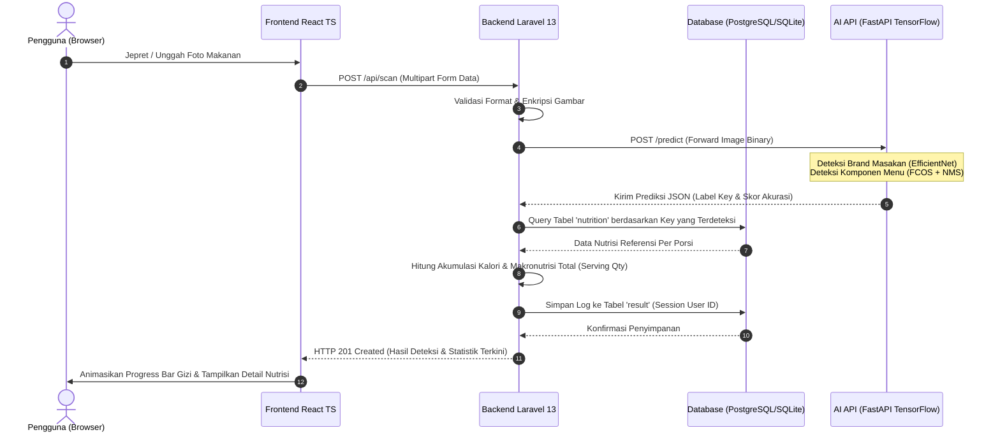

# NutriVision 🥗 — Sistem Analisis Gizi & Deteksi Makanan Visual Berbasis AI

NutriVision adalah platform digital canggih berbasis kecerdasan buatan (*Artificial Intelligence*) yang menggabungkan kekuatan komputasi awan dan model pembelajaran mendalam (*deep learning*) untuk mengenali hidangan kuliner, memperkirakan kandungan makronutrisi, serta mencatat asupan kalori harian secara instan melalui jepretan kamera. Proyek ini dikembangkan sebagai capstone project orisinal yang menggabungkan arsitektur web modern dengan teknik computer vision termutakhir.

---

## 📸 Deskripsi Proyek & Latar Belakang

Dalam era modern dengan mobilitas tinggi, menjaga keseimbangan pola makan sehat menjadi tantangan besar bagi masyarakat urban. Masalah utama yang sering dihadapi adalah kesulitan dalam memantau asupan gizi harian secara konsisten dan akurat. Metode pencatatan manual tradisional sering kali tidak praktis, membosankan, dan rentan terhadap kesalahan estimasi.

**NutriVision** hadir sebagai solusi teknologi mutakhir untuk menjembatani jurang pemisah tersebut. Dengan memanfaatkan kekuatan **Visual Scan AI**, pengguna hanya perlu mengambil foto piring makanan mereka untuk memperoleh analisis nutrisi mendalam secara seketika. Sistem memecah hidangan menjadi komponen makronutrisi esensial (Karbohidrat, Protein, Lemak, dan Kalori) serta menyimpannya ke dalam sistem database log terenkripsi demi menyajikan visualisasi progres kebugaran yang nyata dari waktu ke waktu.

---

## 🛠️ Teknologi Utama

NutriVision dibangun di atas pilar teknologi mutakhir dengan pendekatan type-safe di sisi klien dan performa tangguh di sisi peladen:

1. **Laravel 13 (Backend Engine):** Berperan sebagai RESTful API dan database orchestrator utama. Memanfaatkan fitur-fitur mutakhir Laravel 13, seperti optimalisasi rute, middleware autentikasi tingkat tinggi melalui Laravel Fortify (dengan dukungan 2FA & Google OAuth), dan pemrosesan antrean data secara asinkron.
2. **React TS (Frontend Interface):** Dibangun menggunakan TypeScript yang *strict* untuk memastikan keandalan komponen UI tanpa adanya kesalahan tipe data selama fase kompilasi produksi.
3. **Inertia.js (Seamless Bridge):** Menghubungkan secara langsung *Inertia Controller* di Laravel dengan halaman komponen React di frontend tanpa memerlukan setup API RESTful routing yang kompleks di kedua sisi, menciptakan kenyamanan SPA (*Single Page Application*) dengan kesederhanaan monolitik.
4. **Tailwind CSS v4 (Styling Engine):** Mengimplementasikan sistem desain responsif premium dengan estetika modern, dukungan transisi mikro yang halus, serta kemampuan Light/Dark mode adaptif yang selaras dengan preferensi sistem perangkat pengguna.
5. **TensorFlow & Python FastAPI (AI Inference Engine):** Menjalankan pemrosesan model kecerdasan buatan secara asinkron untuk mendeteksi *brand* masakan dan jenis kuliner secara *real-time* via Hugging Face Space.

---

## 📐 Arsitektur Sistem & Alur Deteksi Objek Gizi

Sistem ini memisahkan peran penyajian data UI dan proses komputasi berat model AI secara terdistribusi. Berikut adalah bagan alur proses deteksi ketika pengguna memindai hidangan mereka:



### Penjelasan Teknis Model Kecerdasan Buatan:
* **Model 1 (Brand Classifier):** Mengidentifikasi sumber penyedia atau gaya masakan (misalnya menu warung lokal, restoran cepat saji tertentu) memanfaatkan model klasifikasi berbasis **EfficientNet** untuk mengenali fitur visual unik dengan jumlah parameter efisien.
* **Model 2 (Menu Object Detector):** Mendeteksi koordinat lokasi bahan makanan di dalam piring masakan secara simultan menggunakan pendekatan **FCOS (Fully Convolutional One-Stage Object Detection)**. Model membagi gambar ke dalam bentuk sel fitur bertingkat (*feature maps*), memprediksi probabilitas kelas bahan, peta *centerness* objek, serta jarak tepi kotak pembatas (*bounding boxes*).
* **Non-Maximum Suppression (NMS):** Dilakukan untuk membuang kotak pembatas tumpang tindih yang redundan berdasarkan skor ambang batas *Intersection over Union* (IoU) tertentu, menyisakan objek hidangan terbaik untuk dianalisis gizinya.

---

## 🌟 Fitur Utama Sistem

* **Visual Scan AI Real-time:** Dukungan WebRTC terintegrasi yang memungkinkan akses kamera instan langsung dari peramban untuk mengambil foto masakan.
* **Multi-Food Detection Aggregation:** Sistem mampu mengidentifikasi beberapa jenis komponen makanan dalam satu piring sekaligus (misal mendeteksi ayam goreng beserta kentang goreng) dan secara otomatis mengakumulasikan seluruh nilai kalorinya dalam satu log makanan tunggal.
* **Konsultasi Gizi "Tanya AI":** Chatbot cerdas interaktif di sisi klien yang dirancang untuk memberikan edukasi seputar diet seimbang, nilai kalori lokal, dan rekomendasi aktivitas olahraga sehat pembakar kalori.
* **Sistem Keamanan Akun Berlapis:** Proteksi autentikasi tangguh dengan pilihan konfirmasi kata sandi, sistem Autentikasi Dua Faktor (2FA) bawaan, serta integrasi masuk instan dengan akun Google (Google OAuth).
* **Dashboard Progres Dinamis:** Grafik visualisasi harian, mingguan, hingga bulanan yang ditarik secara dinamis dari database untuk memantau asupan gizi secara presisi.

---

## 🚀 Langkah Instalasi & Konfigurasi Lingkungan

Ikuti panduan di bawah ini untuk memasang dan menjalankan proyek NutriVision di komputer lokal Anda:

### 📋 Prasyarat Sistem
* **PHP:** Versi `>= 8.3` (pastikan ekstensi `sqlite`, `pdo`, `mbstring`, `openssl`, dan `curl` aktif)
* **Node.js:** Versi `>= 20.x`
* **Composer:** Versi `>= 2.x`
* **Database:** SQLite (default) atau PostgreSQL / MySQL

### 🛠️ Langkah Pengaturan

1. **Unduh Repositori & Masuk ke Direktori Kerja:**
   ```bash
   git clone https://github.com/ridhwananang/nutrivition-071.git nutrivision
   cd nutrivision
   ```

2. **Pasang Dependensi Backend (Composer):**
   ```bash
   composer install
   ```

3. **Pasang Dependensi Frontend (NPM):**
   ```bash
   npm install
   ```

4. **Konfigurasi File Lingkungan (.env):**
   Salin file konfigurasi contoh dan buat kunci enkripsi aplikasi baru:
   ```bash
   cp .env.example .env
   php artisan key:generate
   ```

5. **Setup Database Lokal:**
   Aplikasi dikonfigurasi secara default untuk menggunakan basis data SQLite yang praktis. Buat file database kosong dan jalankan migrasi beserta pengisian data awal (*seeder*):
   ```bash
   # Di sistem Windows (PowerShell)
   New-Item -Path "database" -Name "database.sqlite" -ItemType "file" -Force
   
   # Jalankan migrasi dan seeder data referensi gizi
   php artisan migrate --seed
   ```

6. **Jalankan Aplikasi Dalam Mode Pengembangan:**
   Jalankan server lokal Laravel dan bundler Vite secara bersamaan menggunakan perintah terpadu:
   ```bash
   npm run dev
   ```
   Aplikasi kini dapat diakses melalui browser Anda di tautan: `http://127.0.0.1:8000`

---

## 🧪 Metode Pengujian (Automated Testing)

Untuk memastikan keandalan fungsionalitas backend dan integritas perhitungan kalori, NutriVision dilengkapi dengan suite pengujian otomatis komprehensif menggunakan **Pest PHP Framework**.

### Menjalankan Pengujian
Gunakan perintah artisan berikut untuk menjalankan pengujian di lokal:
```bash
php artisan test
```

### Cakupan Pengujian (*Test Coverage*):
Suite pengujian saat ini mencakup 44 kasus uji yang mencakup:
* **Dynamic Calculations Test:** Memverifikasi kalkulasi dinamis dashboard berdasarkan jumlah porsi makanan yang dikonsumsi harian pengguna.
* **Weekly & Monthly Historical Aggregates:** Menguji kebenaran algoritma visualisasi grafik mingguan dan bulanan agar terhindar dari bias data zona waktu lokal.
* **Multi-item Detection Storage:** Memastikan jika API mendeteksi lebih dari satu item makanan, relasi database Eloquent menyimpan setiap record gizi secara individu dan memformat nama gabungannya secara rapi.
* **Authentication & 2FA Flow:** Menjamin keamanan alur login, pendaftaran akun baru, konfirmasi kata sandi, serta integrasi Google OAuth.